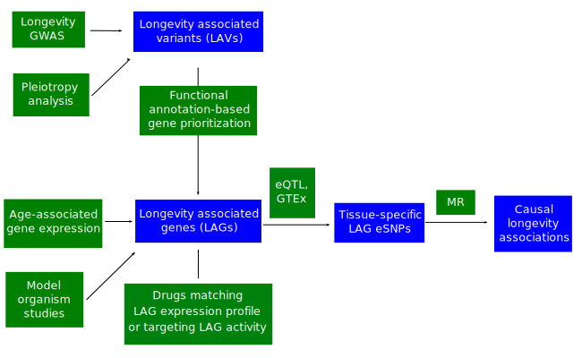

## A. Overview

> An overview of the Longevity Genomics project is given on the [landing
page]({{site.baseurl}}/) of this web site. This page provides descriptions 
of the individual projects. 

Our overall approach is to employ multiple approaches to identify potential longevity-associated genes (LAGs), and then to test the potential that the LAGs can form the basis of translational strategies by performing Mendelian Randomization (MR) analysis. 

{: .center-image }

Candidate genetic variants will be identified for in-depth analysis, and genes likely to be modulated by candidate genetic variants will be identified using functional genomic annotation resources. Tissue-specific genetic instrumental variables for these genes will be constructed to enable Mendelian Randomization analysis to identify causal connections between gene products and healthy aging. Healthy aging phenotypes will be based on data from longitudinal cohort studies, which will include incident disability, incident disease and chronic conditions, and change in physical and cognitive function. Results from these analyses will serve as a foundation for the search for small molecule compounds that might mimic the collective effect of genetic instrumental variables. By identifying small molecules based on therapeutic hypotheses relating molecular function to healthy aging, effective translational research strategies can be developed and disseminated to the research community.

## B. Collaboration and Open Access

To maximize shareability and reproducibility of the data analysis results
generated by this project, most of its analysis routines will be implemented as
R packages hosted on GitHub (_e.g._ [longevityTools](https://github.com/tgirke/longevityTools)). 
At a later stage, suitable components will be contributed to the Bioconductor project. The main 
source of documentation for both users and developers are the vignettes and help files provided by the R packages.
All analysis results can be fully reproduced by rerunning the commands given in the vignettes. Instead of regenerating result files from scratch, users will also be able to download them via URLs provided in the corresponding sections of the vignettes or directly from the [Downloads]({{site.baseurl}}/downloads/) page of this site. While improving transparency for external users, the chosen analysis strategy greatly facilitates collaborations among the different teams and members of this project. Where appropriate, finalized summary results will be made accessible via web-based solutions in the future such as [Shiny](http://shiny.rstudio.com/) and
[ReportingTools](http://bioconductor.org/packages/release/bioc/html/ReportingTools.html).

## C. Current projects

1. **MR analysis of eSNPs and longevity**

2. **Connecting drug- and age-related gene expression signatures**

3. **Longevity drug collection** 
This collection will consist of drugs identified in the "Connecting drug- and age-related gene expression signatures" project, as well as drugs that target gene products identified in the "MR analysis of eSNPs and longevity" project. 

